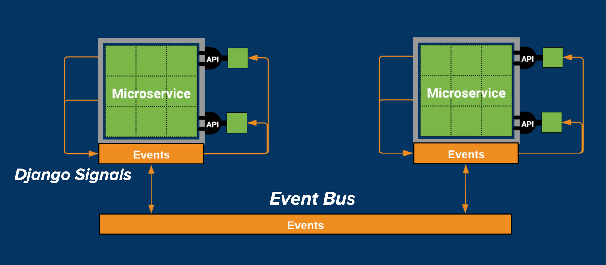
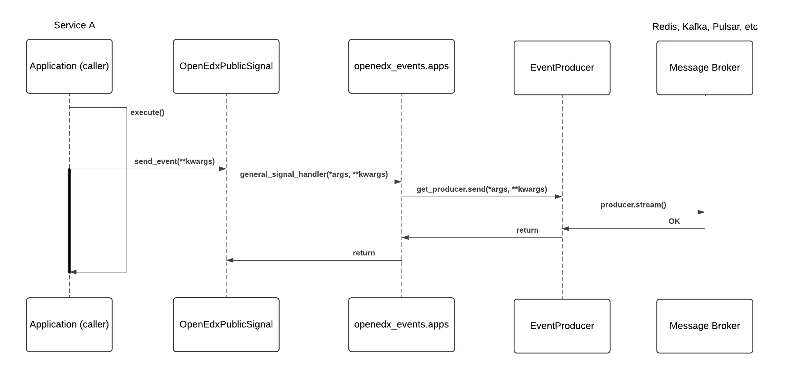
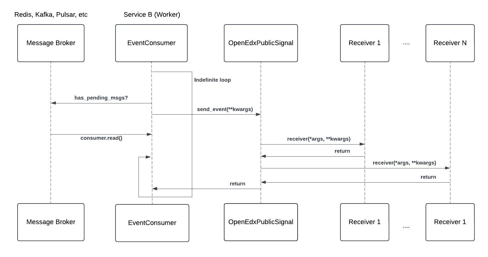
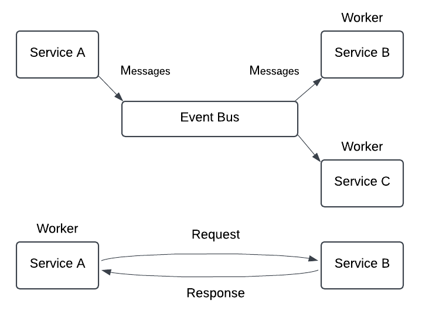

Open edX Event Bus
==================

Overview
--------

The suggested strategy for cross-service communication in the Open edX ecosystem is through an event-based architecture implemented via the :term:`Event Bus`. This functionality used for asynchronous communication between services is built on top of sending Open edX Events (Open edX-specific Django signals) within a service.

What is the Open edX Event Bus?
-------------------------------

The :term:`Event Bus` implements an event-driven architecture that enables asynchronous communication between services using the `publish/subscribe messaging pattern`_ (pub/sub). In the Open edX ecosystem, the event bus is used to broadcast Open edX Events to multiple services, allowing them to react to changes or actions in the system. The event bus is a key component of the Open edX architecture, enabling services to communicate without direct dependencies on each other.

Why use the Open edX Event Bus?
-------------------------------

The :term:`Event Bus` can help us achieve loose coupling between services, replacing blocking requests between services and large sync jobs, leading to a faster, more reliable, and more extensible system. See event messaging architectural goals highlighted in :doc:`openedx-proposals:architectural-decisions/oep-0041-arch-async-server-event-messaging` to read more about its benefits. Here's a brief summary of some key points:

* **Eliminate Blocking, Synchronous Requests**: reduce site outages when services become overloaded with requests by replacing synchronous calls with asynchronous communication.
* **Eliminate Expensive, Delayed, Batch Synchronization**: replace expensive batch processing with near real-time data updates.
* **Reduce the need for Plugins**: reduce the computational load for plugins that don't need to run in the same process by allowing cross-service communication of lifecycle events.

How Does the Open edX Event Bus Work?
-------------------------------------

The Open edX platform uses the ``OpenEdxPublicSignals`` (Open edX-specific Django Signals) to send events within a service. The event bus extends these signals, allowing them to be broadcasted and handled across multiple services. That's how Open edX Events are used for internal and external communication. For more details on how these Open edX-specific Django Signals are used by the event bus, refer to the :doc:`../decisions/0004-external-event-bus-and-django-signal-events` Architectural Decision Record (ADR).

Open edX Events provides an abstract implementation of the `publish/subscribe messaging pattern`_ (pub/sub) which is the chosen pattern for the event bus implementation as explained in :doc:`openedx-proposals:architectural-decisions/oep-0052-arch-event-bus-architecture`. It implements two abstract classes, `EventProducer`_ and `EventConsumer`_ which allow concrete implementations of the event bus based on different message brokers, such as Pulsar.

This abstraction allows for developers to implement their own concrete implementations of the event bus in their own plugins. There are currently two implementations of the event bus, Redis (`event-bus-redis`_) and Kafka (`event-bus-kafka`_). Redis streams is a data structure that acts like an append-only log, and Kafka is a distributed event streaming application. Both implementations handle event production and consumption with technology specific methods.

Architectural Diagram
*********************

These diagrams show what happens when an event is sent to the event bus. The event sending workflow follows the same steps as explained in :ref:`events-architecture`, with a key difference: when configured, the event bus recognizes events and publish them to the message broker for consumption by other services.

Components
~~~~~~~~~~

* **Service A (Producer)**: The service that emits the event. Developers may have emitted this event in a key section of the application logic, signaling that a specific action has occurred.
* **Service B (Consumer)**: The service that listens for the event and executes custom logic in response.
* **OpenEdxPublicSignal**: The class that implements all methods used to manage sending the event. This class inherits from Django's Signals class and adds Open edX-specific metadata and behaviors.
* **Event Producer**: The class in the :term:`Producer` service that sends events to the event bus. The producer serializes the event data and enriches it with relevant metadata for the consumer.
* **Event Consumer**: The class in the :term:`Consumer` service that receives events from the event bus. The consumer deserializes the :term:`message <Message>` and re-emits it as an event with the data that was transmitted.
* **Message Broker**: The :term:`message broker <Message Broker>` is responsible for storing and delivering messages between the producer and consumer.
* **Event Bus Plugin**: The concrete implementation of the event bus (EventProducer and EventConsumer) based on a specific :term:`message broker <Message Broker>`, such as Pulsar. The plugin handles event production and consumption with technology-specific methods.

Workflow
~~~~~~~~

**From Service A (Producer)**

1. When the event is sent, a registered event receiver `general_signal_handler`_ is called to send the event to the event bus. This receiver is registered by the Django Signal mechanism when the ``openedx-events`` app is installed, and it listens for all Open edX Events.
2. The receiver checks the ``EVENT_BUS_PRODUCER_CONFIG`` to look for the ``event_type`` of the event that was sent.
3. If the event type is found and it's enabled for publishing in the configuration, the receiver obtains the configured producer class (``EventProducer``) from the concrete event bus implementation. For example, the producer class for Redis or Kafka implemented in their respective plugins.
4. The ``EventProducer`` serializes the event data and enriches it with relevant metadata, and then transforms it into a message that can be transmitted.
5. The producer uses its technology-specific ``send`` method to publish a message to the configured broker (e.g., Redis or Kafka).

**From Service B (Consumer)**

1. A :term:`Worker` process in Service B runs indefinitely, checking the broker for new messages.
2. When a new message is found, the ``EventConsumer`` deserializes the message and re-emits it as an event with the data that was transmitted.
3. The event sending and processing workflow repeats in Service B.

This approach of producing events via settings with the generic handler was chosen to allow for flexibility in the event bus implementation. It allows developers to choose the event bus implementation that best fits their needs, and to easily switch between implementations if necessary. See more details in the :doc:`../decisions/0012-producing-to-event-bus-via-settings` Architectural Decision Record (ADR).

Event Bus vs Asynchronous Tasks
-------------------------------

Asynchronous tasks are used for long-running, resource-intensive operations that should not block the main thread of a service. The event bus is used for broadcasting messages to multiple services, allowing them to react to changes or actions in the system. Both can be used for asynchronous communication, but they serve different purposes and have different workflows.

In this diagram, you can see the difference between the two when it comes to asynchronous communication:

In the upper part of the diagram, we have Service A and Service B. Service A is the producer of the event, and a :term:`Worker` of Service B is the consumer. This is the event bus workflow which allows asynchronous non-blocking communication between services:

- Service A sends the event as a message to the event bus and continues its execution, as we previously explained.
- Service B polls the message broker for new messages and converts them into ``OpenEdxPublicSignal``.
- Service B emits the event locally and registered Django Signal receivers can react to it.
- Service C can also listen to the event and react to it.

In the lower part of the diagram, we have the asynchronous tasks workflow:

- A worker of Service A picks up a task which communicates with Service B via a request-response mechanism, such as HTTP.
- The worker of Service A sends a request to Service B and waits for a response.
- Service B processes the request and sends a response back to the worker.
- The worker receives the response and continues with the next step in its processing.

If we were to introduce a Service C in this scenario, it would need to wait for the worker of Service A to finish processing the response from Service B and receive a response before it could continue.

This is an example of an asynchronous approach (from the producer point of view) to send messages to another services but with a blocking nature.

Use the Open edX Event bus instead of asynchronous tasks when:

- You want to send a message but don't need a response. For example, notifying other services of an event that occurred.
- You need to send a high volume of messages to a single or multiple services. For example, notifying when users visit a unit in a course or watch a video.
- You want to decouple services and avoid direct dependencies.
- You want to send events out of the Open edX ecosystem. For example, external databases or services that can consume events to update their own state.

When you need to send a message to a particular service and wait their response for further processing, use asynchronous tasks.

How is the Open edX Event Bus Used?
-----------------------------------

The event bus is used to broadcast Open edX Events to multiple services, allowing them to react to changes or actions in the system.

We encourage you to review the :doc:`../reference/real-life-use-cases` page for examples of how the event bus is used in the Open edX ecosystem by the community. Also, see the :doc:`../how-tos/using-the-event-bus` guide to get start sending events to the event bus.

.. _general_signal_handler: https://github.com/openedx/openedx-events/blob/main/openedx_events/apps.py#L16-L44
.. _EventProducer: https://github.com/openedx/openedx-events/blob/main/openedx_events/event_bus/__init__.py#L71-L91
.. _EventConsumer: https://github.com/openedx/openedx-events/blob/main/openedx_events/event_bus/__init__.py#L128-L139
.. _publish/subscribe messaging pattern: https://en.wikipedia.org/wiki/Publish%E2%80%93subscribe_pattern
.. _event-bus-redis: https://github.com/openedx/event-bus-redis/
.. _event-bus-kafka: https://github.com/openedx/event-bus-kafka/
