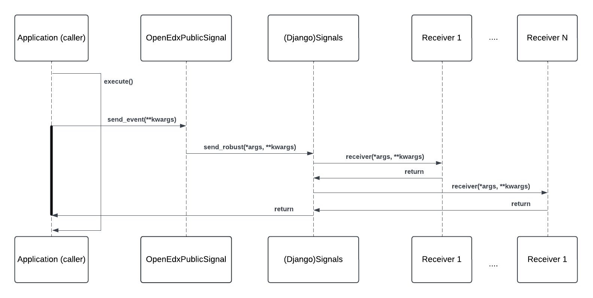

Open edX Events
#################

Overview
**********

Open edX Events provide a mechanism for extending the platform by enabling developers to listen to Open edX-specific Django signals emitted by various services and respond accordingly. This allows for customized reactions to actions or changes within the platform without modifying the Open edX platform codebase, with the main goal of minimizing maintenance efforts for the Open edX project and plugin maintainers.

What Are Open edX Events?
**************************

Open edX Events are signals emitted by a service (e.g., LMS, CMS, or others) within the Open edX ecosystem to notify that an action has occurred. For example, a user may have registered, logged in, or created a course.

These events are built on top of Django signals, inheriting their behavior while also incorporating metadata and actions specific to the Open edX ecosystem, making them uniquely suited for Open edX. Since they are essentially Django signals tailored to Open edX's specific needs, we can refer to `Django Signals Documentation`_ for a more detailed understanding of Open edX Events.

.. note:: Django includes a "signal dispatcher", which helps decoupled applications get notified when actions occur elsewhere in the framework. In a nutshell, signals allow certain senders to notify a set of receivers that some action has taken place. They're especially useful when many pieces of code may be interested in the same events.

Events are primarily used as a communication method between internal services by leveraging Django Signals and external services using the :doc:`../concepts/event-bus`, making them the standard communication mechanism within the Open edX ecosystem.

How Do Open edX Events Work?
****************************

Open edX Events are implemented by a class called `OpenEdxPublicSignal`_, which inherits from `Django's Signals class` and adds behaviors specific to the Open edX ecosystem. Thanks to this design, ``OpenEdxPublicSignal`` leverages the functionality of Django signals, allowing developers to apply their existing knowledge of the Django framework. You can review the :doc:`Open edX Events Tooling <../reference/events-tooling>` documentation for more information on the tooling available for working with Open edX events.

.. _events architecture:

Architectural Diagram
*********************

In this diagram, we illustrate the workflow of emitting and processing an Open edX Event:

Components
==========

* **Application (caller):** The application component that emits the event. Developers may have emitted this event in a key section of the application logic, signaling that a specific action has occurred. E.g., a user has enrolled in a course, `triggering the COURSE_ENROLLMENT_CREATED event`_.
* **OpenEdxPublicSignal:** The class that implements all methods used to manage sending the event. As mentioned previously, this class inherits from Django's Signals class and adds Open edX-specific metadata and behaviors.
* **Django Signals:** The Django framework's built-in signal mechanism.

* **Receiver1...ReceiverN:** The components that listen to the event and execute custom logic in response. These receivers are implemented as Django signal receivers.

Workflow
=========

#. An application (caller) emits an event by calling the `send_event`_ method implemented by `OpenEdxPublicSignal`_ which the event inherits from.

#. The caller passes the :term:`event payload<Event Payload>` to the `send_event`_ method. The event payload is the data associated with the event that is passed to the receivers when it's triggered. It uses data attribute classes (e.g. ``CourseEnrollmentData``, ``UserData``, etc.) to carry data about the event.

#. The `send_event`_ method generates Open edX-specific metadata for the event on the fly, like the event version or the timestamp when the event was sent. The event receivers can access this metadata during their processing.

#. After, the `send_event`_ method calls the `send or send_robust`_ method from Django Signals under the hood. The ``send`` method is used for development and testing, while the ``send_robust`` method is used in production to ensure receivers don't raise exceptions halting the application process.

#. Building on Django Signals allows us to use the same `Django signals registry mechanism`_ for receiver management. This means that developers can register `signal receivers in their plugins`_ for Open edX Events in the same way they would for Django signals.

#. All registered receivers are executed in the order they were registered. Each receiver processes the event data and performs the necessary actions.

#. After all receivers for the event have been executed, the process continues with the application logic.

Here is an example of an event that saves a user's notification preferences when they enroll in a course:

#. A user enrolls in a course, `triggering the COURSE_ENROLLMENT_CREATED event`_. This event includes information about the user, course, and enrollment details.

#. A signal receiver listening for the ``COURSE_ENROLLMENT_CREATED`` event is called and processes the event data.  In this case, it would be the `course_enrollment_post_save receiver`_.

#. The signal receiver creates a notification preference for the user, enabling them to receive notifications about the course.

#. The application continues with the course enrollment process.

The `Django Signals Documentation`_ provides a more detailed explanation of how Django signals work.

How Are Open edX Events Used?
*****************************

As mentioned previously, developers can listen to Open edX Events by registering signal receivers from their Open edX Django plugins that respond to the emitted events or by using the :doc:`../concepts/event-bus` to send events to external services.

For more information on using Open edX Events, refer to the :doc:`../how-tos/create-a-new-event` how-to guide. We also encourage you to explore the :doc:`../reference/real-life-use-cases` section for real-life examples of how Open edX Events are used by the community.

.. _Django Signals Documentation: https://docs.djangoproject.com/en/4.2/topics/signals/
.. _triggering the COURSE_ENROLLMENT_CREATED event: https://github.com/openedx/edx-platform/blob/master/common/djangoapps/student/models/course_enrollment.py#L777-L795
.. _course_enrollment_post_save receiver: https://github.com/openedx/edx-platform/blob/master/openedx/core/djangoapps/notifications/handlers.py#L38-L53
.. _Django signals registry mechanism: https://docs.djangoproject.com/en/4.2/topics/signals/#listening-to-signals
.. _signal receivers in their plugins: https://edx.readthedocs.io/projects/edx-django-utils/en/latest/edx_django_utils.plugins.html#edx_django_utils.plugins.constants.PluginSignals
.. _Open edX Django plugins: https://edx.readthedocs.io/projects/edx-django-utils/en/latest/plugins/readme.html
.. _OpenEdxPublicSignal: https://github.com/openedx/openedx-events/blob/main/openedx_events/tooling.py#L37
.. _Django's Signals class: https://docs.djangoproject.com/en/4.2/topics/signals/#defining-and-sending-signals
.. _send_event: https://github.com/openedx/openedx-events/blob/main/openedx_events/tooling.py#L185
.. _send or send_robust: https://docs.djangoproject.com/en/4.2/topics/signals/#sending-signals

**Maintenance chart**

+--------------+-------------------------------+----------------+--------------------------------+
| Review Date  | Reviewer                      |   Release      |Test situation                  |
+--------------+-------------------------------+----------------+--------------------------------+
|2025-02-05    | Maria Grimaldi                |  Sumac         |Pass.                           |
+--------------+-------------------------------+----------------+--------------------------------+
